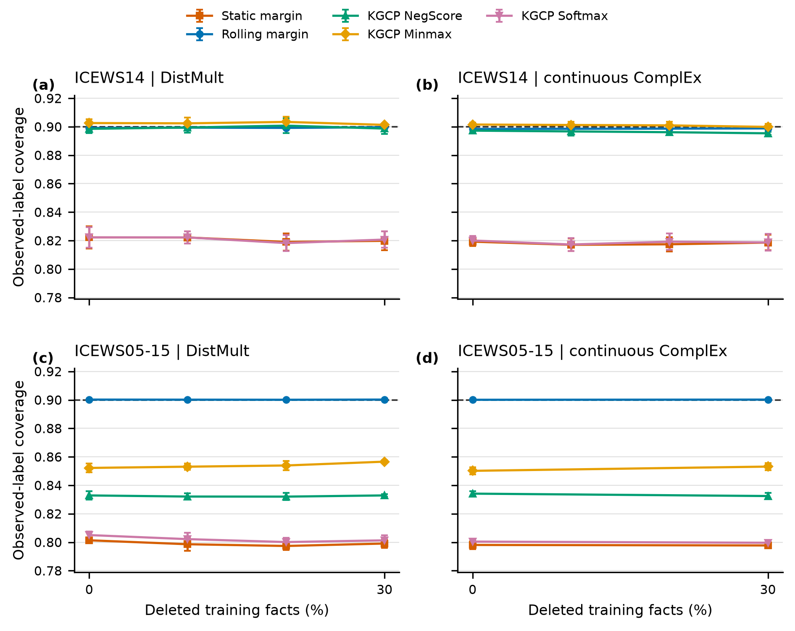
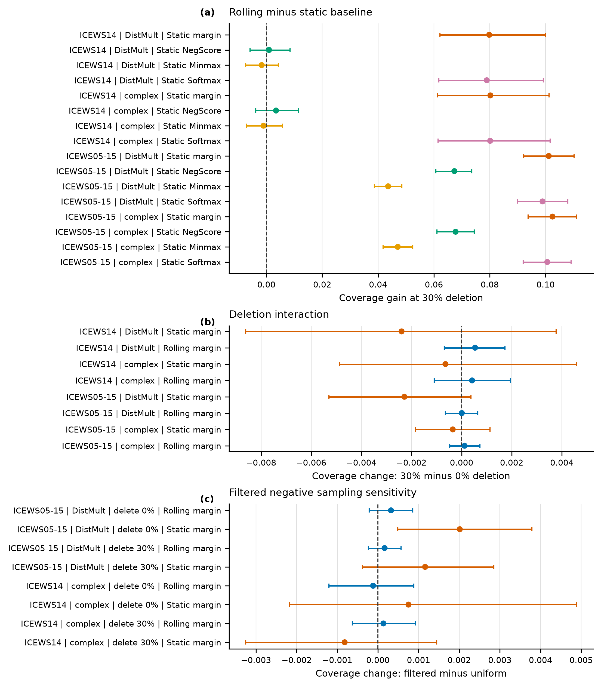
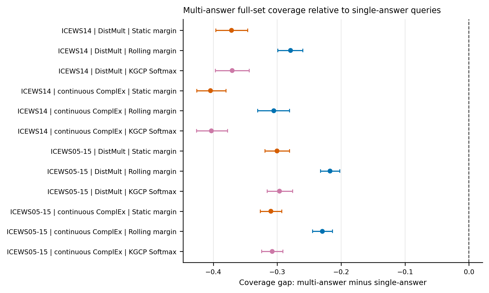

# 时序知识图谱预测的预序贯答案集校准

**英文题目：** Prequential Answer-Set Calibration for Temporal Knowledge Graph Forecasting

**作者：** Xinyu Wang

**单位：** 安徽信息工程学院，中国安徽芜湖 241000

**通信邮箱：** xywang68@iflytek.com

> 本文档为英文投稿稿件的逐章中文翻译。公式、数值、置信区间和结论边界均与英文稿对应。文末“理解附录”用于帮助非专业读者理解，不属于英文投稿正文。

## 摘要

时序知识图谱能够支持事件预测，但排序指标无法说明一个模型能否给出具有可靠覆盖率的答案集合。静态保形校准对这一任务很有吸引力，但它在时间切分后的表现仍不确定。本文在按时间戳成批处理的协议下，将滚动式预序贯边际规则与静态边际规则以及三种已发表的 KGCP 分数变换进行比较。研究覆盖 ICEWS14 和 ICEWS05-15 两个数据集、时序 DistMult 与一个在相同实验协议下实现的连续时间复数评分器、五个随机种子、对训练事实的受控删除，以及过滤负采样敏感性分析。在目标覆盖率为 0.90、删除率为 30% 时，滚动校准的覆盖率为 0.8988 至 0.9002。相对于静态边际规则，其提升为 0.0798 至 0.1025；但在 ICEWS14 上，它与 KGCP Minmax 和 NegScore 的差异并不确定。可靠性需要付出效用代价：滚动方法平均返回 3818 至 4307 个实体，其集合大小是 KGCP Minmax 的 1.63 至 2.22 倍。多答案查询的完整集合覆盖率仍比单答案查询低 0.217 至 0.305。训练事实删除与负采样方式的影响大多很小或无法得出确定结论。基于近期历史的校准能够修复总体时间欠覆盖，但它并非在所有比较中都更优，也没有解决集合效用或多答案查询问题。

**关键词：** 时序知识图谱；链接预测；保形预测；预序贯评估；不确定性量化；答案集；分布变化

## 1. 引言

时序知识图谱（temporal knowledge graph, TKG）用带时间戳的关系表示实体之间的联系，并用于预测未来事件、交互和状态。一个典型查询要求模型判断哪个实体能够补全形如 `(s, r, ?, t)` 的四元组。现代 TKG 模型通常使用过滤后的平均倒数排名（MRR）和 Hits@K 进行比较 [1-4]。这些指标评价候选实体的排序，却不能回答模型返回的答案集合能否以指定比例覆盖一个被记录为正确的实体。当预测结果交给人工分析人员或下游决策规则时，这一区别十分重要：排序较好的模型仍可能给出不可靠的置信度，而名义上可靠的答案集合也可能大到无法实际使用。

保形预测可以在不要求标签概率模型正确的情况下，把模型分数转换为预测集合 [5,6]。KGCP 将这一思想用于静态知识图谱嵌入，CondKGCP 进一步研究了按谓词分条件的答案集合 [7,8]。这些工作建立了有价值的静态基线，但时序预测具有不同的信息结构：校准数据必须先于测试查询，分数分布可能随时间变化，而且在同一测试时间戳上的全部查询完成预测之前，不能使用该时间戳的标签。协变量偏移、自适应保形推断和非交换数据方法处理了相关问题，但它们依赖特定假设或更新规则，不能未经验证地直接移植到时序知识图谱 [9-13]。

本文研究一个范围明确的经验问题：**在时间切分之后，仅利用严格早于当前时刻的近期 TKG 分数进行校准，能否提高答案集可靠性；如果能，需要付出多大的代价？** 为回答该问题，本文采用按时间戳成批处理的预序贯协议。冻结后的评分器在时刻 `t` 对全部主语查询和宾语查询作出预测；只有当这一批次全部记录完成后，其中已观测到的标签才能加入校准历史。研究将静态边际校准和滚动边际校准，与 KGCP 报告的 NegScore、Minmax 和 Softmax 非一致性变换进行比较。这里的 KGCP 基线是在同一协议下实现的分数变换基线，并非对 KGCP 作者完整训练流程的精确复现。

为应对三类效度威胁，本文扩展了评估。第一，在 ICEWS14 之外加入时间跨度更长的 ICEWS05-15 事件图。第二，在时序 DistMult 之外加入一个连续时间复数评分器；该评分器采用 ComplEx 风格的分解，但不是官方 TComplEx 优化器 [14,15]。第三，在成对的敏感性条件下比较过滤负样本和均匀负样本。最终实验矩阵包含 90 个完成的“随机种子—删除率”条件、286,480 条时间戳汇总记录和 2860 万条查询级记录。

主要发现需要谨慎限定。滚动边际校准在四种“数据集—评分器”组合中都将总体覆盖率恢复到接近名义值，但它在 ICEWS14 上并未稳定优于 KGCP Minmax 或 NegScore，而且返回的集合大得多。多答案查询中，全部被记录答案同时获得覆盖的概率仍显著低于单答案查询。此外，受控删除训练事实并没有显著加剧静态覆盖失效，过滤负采样的影响也大多不确定。因此，本文的贡献是可靠性诊断和防止信息泄漏的评估协议，而不是新的分布无关覆盖定理，也不是对方法普遍优越性的主张。

## 2. 相关工作

### 2.1 时序知识图谱预测

TKG 补全方法包括时序序列编码器、张量分解方法以及循环图网络 [1-3,15]。简单的历史规则仍可能具有竞争力，这说明实验协议的严谨性与模型复杂度同样重要 [16,17]。本文的校准层只接收冻结模型输出的全实体分数向量，不改变候选实体原有的排序。因此，本文在两类评分器上进行评估，但不把校准层描述为一种新的预测骨干模型。

### 2.2 校准与保形答案集

已有研究考察了神经分类器和知识图谱嵌入的后处理概率校准 [18,19]。KGCP 使用 NegScore、按查询 Minmax 和 Softmax 分数变换，为知识图谱链接预测构建保形答案集 [7]；CondKGCP 随后把这一方向扩展到按谓词分条件的情形 [8]。APS 和 RAPS 为分类器提供基于排序概率质量的预测集合 [20]。本文在相同数据切分和评分器下，将 KGCP 的三种分数变换作为静态基线。RAPS 只保留为次要的、通过验证集选择的效用诊断，因为时间顺序使其针对可交换数据的保证不能自动成立。

### 2.3 非交换条件下的校准

加权保形预测、自适应保形推断和后续非交换分析表明，在特定类型的分布变化或在线反馈条件下，可以如何研究覆盖率 [9-12]。NCPNET 则研究了非交换时序图神经网络 [13]。本文的滚动规则有意保持简单：它仅从最近已揭示的分数中估计经验分位数，不使用似然比权重，也不给测试点附加质量。因此，本文不声称该规则在任意漂移下具有有限样本保证。

## 3. 问题定义与预序贯协议

### 3.1 查询、答案集与指标

令 `E` 和 `R` 分别表示封闭的实体词表和关系词表。一个 TKG 由四元组 `(s, r, o, t)` 构成。宾语查询写为 `x=(s,r,?,t)`，其中问号 `?` 表示需要预测的实体槽位，并不是稿件中缺失的文字。主语预测通过 `(o,r^{-1},?,t)` 表示。对于查询 `x`，令 `Y_t(x)⊆E` 表示时间戳 `t` 上所有被记录的答案，`C_t(x)` 表示预测集合。

主要可靠性指标是观测标签覆盖率：

`Cov_label = (1/N) Σ_(x,y) 1{y ∈ C_t(x)}.`

这一标签边际指标不同于完整集合查询覆盖率 `1{Y_t(x)⊆C_t(x)}`。本文同时报告这两个指标、平均集合大小以及过滤 MRR。对多答案查询，部分答案召回率定义为 `|Y_t(x)∩C_t(x)|/|Y_t(x)|`。文中的“覆盖”始终是对基准数据中已记录标签而言，不代表现实世界中所有可能为真的事件。

### 3.2 静态校准与滚动校准

令 `f_θ(x,y)` 表示冻结 TKG 模型对候选实体 `y` 的分数。边际非一致性分数定义为：

`a_margin(x,y) = max_(z∈E) f_θ(x,z) - f_θ(x,y),`

并据此得到预测集合：

`C_q(x) = {y : a_margin(x,y) ≤ q}.`

对于校准分数 `a_1,...,a_n` 和目标覆盖率 `1-α`，有限样本阈值取排序后第 `min{n, ceil[(n+1)(1-α)]}` 个分数。静态边际方法只在最终初始校准区间上估计一次阈值。滚动边际方法在每个测试时间戳重新估计阈值，仅使用严格早于当前时间戳、最近的 `W=1000` 个已揭示分数。

KGCP 基线使用完全相同的冻结分数张量和静态校准区间。对候选分数向量 `f`，三种非一致性分数为：

`a_Neg(y) = -f_y,`

`a_Minmax(y) = -(f_y-min_z f_z)/(max_z f_z-min_z f_z),`

`a_Softmax(y) = 1-exp(f_y/T)/Σ_z exp(f_z/T).`

当 Minmax 的分母为零时，该向量映射为零；Softmax 温度固定为 `T=1`。本文使用已发表的分数定义，但没有重新训练原 KGCP 模型，也没有复现其完整优化器。因此，这些比较隔离了同一协议下的“分数变换”和“时间更新”两个因素。

在测试时间戳 `t`，全部查询都完成评分并保存预测集合之后，才揭示该时间戳的任何标签；随后整个批次被加入滚动校准池。这个批次边界阻止同一时间戳内部的信息泄漏。

### 3.3 经验阈值能够保证什么，不能保证什么

在冻结评分器以及时间戳 `t` 之前所有可用信息的条件下，令 `F_t` 为当前标签非一致性分数的累积分布函数，`H_(t,w)` 为加权校准池所代表的总体混合分布，`Ĥ_(t,w)` 为其经验分布函数。定义：

`δ_t = sup_u |F_t(u)-H_(t,w)(u)|,`

`ε_t = sup_u |Ĥ_(t,w)(u)-H_(t,w)(u)|,`

并令 `η_t` 为赋给同一取值的分数所拥有的最大经验总权重。

**命题 1（集合几何性质）。** 对非负阈值 `q_1≤q_2`，有 `C_(q_1)(x)⊆C_(q_2)(x)`，且 `C_(q_1)(x)` 非空。此外，`Y_t∈C_(q_t)(X_t)` 当且仅当观测标签的非一致性分数不超过 `q_t`。

**证明。** 预测集合是非一致性分数的下水平集，因此会随阈值增加而扩大。得分最高的实体边际为零。最后一项直接由 `C_q` 的定义得到。证毕。

**命题 2（确定性覆盖分解）。** 对覆盖水平 `1-α` 的包含式经验阈值，有：

`1-α-δ_t-ε_t ≤ F_t(q_t) ≤ 1-α+δ_t+ε_t+η_t,`  （1）

上下界均截断到区间 `[0,1]`。

**证明。** 在包含式分位数处，经验累积分布函数至少为 `1-α`，因此历史总体分布函数至少为 `1-α-ε_t`，而当前分布函数最多再向下偏离 `δ_t`。在该分位数之前，经验累积分布函数小于 `1-α`，其跳跃不超过 `η_t`。对上界应用同样的两项上确界偏差即可。证毕。

式（1）是一种分解，不是新的分布无关保证。较短的历史窗口可能减小时间错配 `δ_t`，同时增大估计误差或并列分数质量。本文实验测量由此产生的可靠性—效用权衡，而不预设近期历史一定更好。

## 4. 实验设计

### 4.1 数据、评分器与实验条件

ICEWS14 和 ICEWS05-15 是来源于 ICEWS 编码事件数据的事件知识图谱基准 [21]。下表给出规范化后的图规模。关系数量不包括为了主语预测而在程序内部加入的逆关系。

| 数据集 | 实体数 | 关系数 | 事实数 | 时间戳数 |
| --- | ---: | ---: | ---: | ---: |
| ICEWS14 | 7,128 | 230 | 90,730 | 365 |
| ICEWS05-15 | 10,488 | 251 | 461,329 | 4,017 |

所有唯一时间戳按先后排序：最早 60% 用于训练评分器，中间 20% 提供四个互不重叠的验证与校准用途，最后 20% 构成测试流。中间区间继续按时间顺序划分为：25% 评分器验证、30% 校准器调参、15% 选择器验证，以及 30% 最终初始校准。

时序 DistMult 使用 256 维实数嵌入。第二个评分器使用 128 维复数嵌入，并用常数、线性、二次、正弦和余弦特征构成共享的连续时间映射。它是在匹配协议下实现的 ComplEx 风格替代评分器，而不是离散时间 TComplEx 训练过程的精确实现。两个评分器都使用成对 softplus 目标、Adam 优化器、`10^-3` 学习率、`10^-6` 权重衰减、1024 的批大小、128 个负样本、最多 200 轮训练，并根据验证结果提前停止。

主要实验矩阵使用过滤训练负样本以及五个随机种子 `{17,29,43,59,71}`。ICEWS14 在两个评分器上测试删除率 `{0,0.1,0.2,0.3}`；ICEWS05-15 的 DistMult 使用全部四个删除率，复数评分器使用 `{0,0.3}`。删除只作用于训练事实。删除是有随机种子的均匀删除；如果删除会使某个实体在训练数据中的全部出现消失，则保留该实体最早的训练事实。均匀负采样敏感性实验在删除率 0 和 0.3 下进行，覆盖 ICEWS05-15 DistMult 与 ICEWS14 连续 ComplEx。过滤负样本仅排除训练图中保留的正事实，不使用未来事实。

### 4.2 推断与可复现性

目标覆盖率为 0.90。主要不确定性区间采用 20,000 次等随机种子权重的圆形移动块自助法，主块长为七个时间戳；块长 3、14 和 21 用作敏感性检查。成对比较复用相同的随机种子和时间戳块。分析报告覆盖率、平均集合大小、过滤 MRR、完整集合查询覆盖率和部分答案召回率。

完整代码、解析后的配置、论文数据、图表生成脚本、校验和与发布审计位于：`https://github.com/xywang815/riskcal-tkg-w`。原始 ICEWS 数据来自 `https://doi.org/10.7910/DVN/28075` 以及代码仓库中说明的公开基准档案。

OpenAI Codex 被用于辅助代码开发、实验编排、语言编辑和文档排版。作者审阅了源代码，核验了由校验和绑定的输出，并对分析、图表和稿件承担责任。

## 5. 结果

计划中的 90 个“随机种子—删除率”条件全部完成。证据包括 286,480 条时间戳记录和 28,626,600 条“查询—标签”记录，其中 4,858,050 条来自多答案查询。以下结果不使用任何未完成条件或先导实验结果。

### 5.1 覆盖结果可跨设置复现，但最佳静态基线取决于数据集

图 1 展示观测标签覆盖率。在删除 30% 训练事实时，滚动边际在 ICEWS14 上使用 DistMult 和连续 ComplEx 分别得到 0.8996 和 0.8988 的覆盖率；在 ICEWS05-15 上，两个评分器均得到 0.9002。相对于静态边际，四个对应提升分别为 0.0798（95% 置信区间 [0.0621, 0.0999]）、0.0802（[0.0612, 0.1012]）、0.1011（[0.0921, 0.1102]）和 0.1025（[0.0937, 0.1111]）。KGCP Softmax 的行为与静态边际相似，在四种设置中也都出现欠覆盖。

与更强 KGCP 变换的比较具有异质性。在 ICEWS05-15 上，滚动边际相对于 KGCP Minmax 的提升，在 DistMult 上为 0.0436（[0.0387, 0.0486]），在连续 ComplEx 上为 0.0471（[0.0418, 0.0524]）；相对于 KGCP NegScore 的提升分别为 0.0673 和 0.0678。但在 ICEWS14 上，滚动减 Minmax 的区间分别为 [-0.0074, 0.0042] 和 [-0.0072, 0.0058]，相对于 NegScore 的区间也跨过零。KGCP Minmax 与 NegScore 在 ICEWS14 上已经达到近似名义覆盖率。因此，滚动校准是相对于两种欠覆盖静态规则的稳健时间修复，但不是对所有 KGCP 分数都一致更优。

### 5.2 接近名义覆盖率需要很大的预测集合

删除率为 30% 时，滚动方法在 ICEWS14 上使用 DistMult 和连续 ComplEx 的平均集合大小分别为 3,870.6 和 3,818.0 个实体；在 ICEWS05-15 上分别为 4,307.2 和 4,260.1。它们是 KGCP Minmax 集合大小的 1.63 至 2.22 倍，也是静态边际集合大小的 1.41 至 1.85 倍。在 ICEWS14 上，KGCP Minmax 用明显更小的集合达到了名义覆盖率；在 ICEWS05-15 上，滚动边际比 KGCP Minmax 更可靠，但平均集合大小超过其两倍。这些结果描述的是可靠性—效用前沿，而不是某个方法在所有方面获胜。

### 5.3 删除和负采样不能解释主要效果

图 2 将方法差异与两个压力测试分开显示。对“删除 30% 减删除 0%”的比较，所有静态边际和滚动边际覆盖率区间都包含零。静态变化范围为 -0.0024 至 -0.0004，滚动变化范围为 0.0000 至 0.0005。因此，实验不支持“删除训练事实导致静态校准失效”这一说法。删除只保留为一种受控评分器压力，而时间错配是更有依据的问题动机。

在四个成对条件中，“过滤减均匀”的滚动效应区间也都包含零。只有 ICEWS05-15 DistMult 在不删除训练事实时，静态边际出现很小的正效应 0.0020（[0.0005, 0.0038]）；其他静态区间均跨过零。主要覆盖结论并不是由所测试的负采样选择驱动的。

### 5.4 多答案查询仍然是一个失败模式

标签边际覆盖率可能掩盖预测集合能否包含某个查询的全部答案。在删除率为 30% 时，ICEWS14 DistMult 上滚动方法的多答案查询完整集合覆盖率比单答案查询低 0.2792，95% 区间为 [-0.2992, -0.2600]。ICEWS14 连续 ComplEx 的差距为 -0.3054，ICEWS05-15 DistMult 为 -0.2174，ICEWS05-15 连续 ComplEx 为 -0.2294（图 3）。例如，ICEWS14 DistMult 的滚动完整集合覆盖率在多答案查询上为 0.6532，在单答案查询上为 0.9305。滚动校准相对于静态边际和 KGCP Softmax 缩小了差距，但没有消除它。

## 6. 讨论与结论

实验对中心问题给出了带条件的肯定回答：利用严格早于当前时刻的分数更新边际阈值，可以在两个 ICEWS 数据集和两类评分器上把总体覆盖率恢复到接近 0.90。在 ICEWS05-15 上，仅仅更换静态分数并不能得到相同结论，三种 KGCP 变换均低于目标；但在 ICEWS14 上，KGCP Minmax 和 NegScore 已经用较小的集合达到接近目标的覆盖率。因此，实际选择取决于数据集，也取决于应用对漏掉正确标签和返回过大候选集合分别赋予多高代价。

负结果收窄了本文的贡献。训练事实删除没有明显加剧静态欠覆盖，因此不能作为校准失效的因果解释。过滤训练负样本在成对检验中对覆盖率的影响也很小。这两项干预是有用的稳健性检查，但都不支持广泛的机制性主张。稳定出现的现象是：在时间顺序下，较早固定的阈值与近期历史阈值之间存在差异。

多答案诊断更为严峻。一个方法可以达到名义标签边际覆盖率，却仍然无法在许多查询上包含全部已记录答案。这一缺口部分来自指标本身：每增加一个有效标签，“全部包含”事件都会更难发生；它也有直接的实际意义，因为多答案查询往往正是最需要短名单帮助的情况。未来方法应直接校准查询级集合覆盖率或结构化答案召回率，而不是把同一查询的重复标签视为相互独立的样本。

研究仍有若干限制。ICEWS14 和 ICEWS05-15 都是政治事件图，不能代表广泛的时序图领域。连续复数评分器是在匹配协议下实现的模型，不是官方 TComplEx 优化器或检查点。KGCP 基线同样只复现已发表分数变换并使用共同静态校准切分，而不是原方法的完整流水线。五个随机种子限制了对训练随机性的推断，移动块自助法也只是对时间依赖的近似。对于实体词表显著更大的数据集，精确的全实体评分还会变得昂贵。

在实际应用中，如果近期标签能在下一批预测前到达，滚动校准可以用作审计和修复工具。但部署时不能只看覆盖率，还必须同时检查平均和尾部集合大小、反馈延迟、关系侧表现以及多答案完整集合覆盖率。未来工作应测试官方或循环式 TKG 骨干、非事件和归纳式数据集、按谓词分条件的时序校准，以及具有明确多答案目标的紧凑结构化集合。

总之，基于近期历史的预序贯校准可以纠正总体时间欠覆盖，但其改进取决于所比较的基线，并且经常需要包含数千个候选实体。现有证据支持一种透明的可靠性—效用诊断；它不支持方法普遍优越、删除驱动的失效机制，也不支持在任意时间漂移下的分布无关覆盖保证。

## 作者贡献

构思，X.W.；方法，X.W.；软件，X.W.；验证，X.W.；形式分析，X.W.；研究，X.W.；数据整理，X.W.；初稿撰写，X.W.；审阅与编辑，X.W.；可视化，X.W.；项目管理，X.W.；经费获取，X.W.。作者已阅读并同意论文最终版本。

## 基金项目

本研究由安徽省高校自然科学研究项目资助，项目编号 2023AH052916。

## 伦理审查声明

不适用。

## 知情同意声明

不适用。

## 数据可用性声明

本研究使用从公开 ICEWS 编码事件数据衍生的 ICEWS14 和 ICEWS05-15，数据 DOI 为 `https://doi.org/10.7910/DVN/28075`。源代码、预处理脚本、解析后的配置、派生结果表、图表生成脚本、校验和以及干净克隆发布审计，均以 MIT License 发布在 `https://github.com/xywang815/riskcal-tkg-w`。本次投稿快照使用标签 `v1.0.0-mdpi-information-submission` 标识。

## 利益冲突

作者声明不存在利益冲突。资助方未参与研究设计、数据收集、分析或解释、稿件撰写以及是否发表研究结果的决定。

## 参考文献

参考文献的作者、英文题名、出版信息与 DOI 按英文稿保留：

1. García-Durán, A.; Dumančić, S.; Niepert, M. Learning Sequence Encoders for Temporal Knowledge Graph Completion. EMNLP, 2018, 4816-4821. https://doi.org/10.18653/v1/D18-1516
2. Li, Z.; et al. Temporal Knowledge Graph Reasoning Based on Evolutional Representation Learning. SIGIR, 2021, 408-417. https://doi.org/10.1145/3404835.3462963
3. Li, Y.; Sun, S.; Zhao, J. TiRGN: Time-Guided Recurrent Graph Network with Local-Global Historical Patterns for Temporal Knowledge Graph Reasoning. IJCAI, 2022, 2152-2158. https://doi.org/10.24963/ijcai.2022/299
4. Cai, B.; et al. Temporal Knowledge Graph Completion: A Survey. IJCAI, 2023, 6545-6553. https://doi.org/10.24963/ijcai.2023/734
5. Vovk, V.; Gammerman, A.; Shafer, G. Algorithmic Learning in a Random World. Springer, 2005. https://doi.org/10.1007/b106715
6. Angelopoulos, A.N.; Bates, S. A Gentle Introduction to Conformal Prediction and Distribution-Free Uncertainty Quantification. Foundations and Trends in Machine Learning, 2023, 16, 494-591. https://doi.org/10.1561/2200000101
7. Zhu, Y.; et al. Conformalized Answer Set Prediction for Knowledge Graph Embedding. NAACL-HLT, 2025, 731-750. https://doi.org/10.18653/v1/2025.naacl-long.32
8. Zhu, Y.; et al. Predicate-Conditional Conformalized Answer Sets for Knowledge Graph Embeddings. Findings of ACL, 2025, 4145-4167. https://doi.org/10.18653/v1/2025.findings-acl.215
9. Tibshirani, R.J.; et al. Conformal Prediction Under Covariate Shift. NeurIPS, 2019, 32.
10. Gibbs, I.; Candès, E. Adaptive Conformal Inference Under Distribution Shift. NeurIPS, 2021, 34.
11. Barber, R.F.; et al. Conformal Prediction Beyond Exchangeability. The Annals of Statistics, 2023, 51, 816-845. https://doi.org/10.1214/23-AOS2276
12. Farinhas, A.; et al. Non-Exchangeable Conformal Risk Control. ICLR, 2024.
13. Wang, T.; et al. Non-exchangeable Conformal Prediction for Temporal Graph Neural Networks. KDD, 2025, 3031-3042. https://doi.org/10.1145/3711896.3737064
14. Yang, B.; et al. Embedding Entities and Relations for Learning and Inference in Knowledge Bases. ICLR, 2015.
15. Lacroix, T.; Obozinski, G.; Usunier, N. Tensor Decompositions for Temporal Knowledge Base Completion. ICLR, 2020.
16. Gastinger, J.; et al. History Repeats Itself: A Baseline for Temporal Knowledge Graph Forecasting. IJCAI, 2024, 4016-4024. https://doi.org/10.24963/ijcai.2024/444
17. Gastinger, J.; et al. TGB 2.0: A Benchmark for Learning on Temporal Knowledge Graphs and Heterogeneous Graphs. NeurIPS, 2024, 37. https://doi.org/10.52202/079017-4450
18. Guo, C.; et al. On Calibration of Modern Neural Networks. ICML, 2017, 1321-1330.
19. Safavi, T.; Koutra, D.; Meij, E. Evaluating the Calibration of Knowledge Graph Embeddings for Trustworthy Link Prediction. EMNLP, 2020, 8308-8321. https://doi.org/10.18653/v1/2020.emnlp-main.667
20. Angelopoulos, A.N.; et al. Uncertainty Sets for Image Classifiers Using Conformal Prediction. ICLR, 2021.
21. Boschee, E.; et al. ICEWS Coded Event Data. 2015. https://doi.org/10.7910/DVN/28075

# 理解附录（非英文投稿正文）

## A. 用一句话理解这篇论文

这篇论文不试图发明一个新的知识图谱预测模型，而是检查已有模型给出的“答案候选名单”是否可靠，并研究只用近期历史进行校准，能否比一直使用早期固定阈值更好地维持 90% 左右的覆盖率。

## B. 最重要的五个概念

1. **知识图谱**：把“人、组织、国家”等对象看成实体，把“访问、合作、冲突”等看成关系。例如“甲国—访问—乙国”。
2. **时序知识图谱**：在关系事实之外再加入时间。例如“甲国在 2026 年 8 月访问乙国”。
3. **链接预测**：给出前三项和时间，让模型猜空缺实体，例如“甲国—访问—？—某日”。
4. **预测集合**：模型不只返回第一名，而是返回一组候选实体，希望正确答案以约定概率出现在其中。
5. **校准**：根据过去已经知道答案的样本设定阈值，让候选集合的覆盖率尽量接近目标。本文目标是 0.90。

## C. 整体实验过程

1. 获取并规范化 ICEWS14 与 ICEWS05-15 两个公开事件知识图谱。
2. 严格按时间切分数据：前 60% 训练评分器，中间 20% 承担验证和校准，后 20% 作为按时间到来的测试流。
3. 分别训练时序 DistMult 和连续时间复数评分器，并在训练后冻结其参数。
4. 对每个测试查询计算所有候选实体的分数，形成原始排序。
5. 用静态边际、滚动边际，以及 KGCP NegScore、Minmax、Softmax 五种规则把分数转换成答案集合。
6. 在滚动方案中，某个时间戳的全部预测完成后，才把该时间戳的真实标签加入历史，避免偷看同一时间戳答案。
7. 在五个随机种子和多种训练事实删除率下重复实验，并增加过滤负采样与均匀负采样的成对敏感性比较。
8. 对覆盖率、集合大小、MRR、完整集合覆盖率和多答案召回进行汇总。
9. 用 20,000 次时间戳移动块自助法估计成对效应及 95% 区间，并用不同块长检查结果对时间相关性假设是否敏感。
10. 对所有配置、结果 CSV、图表和脚本计算校验和，再从干净克隆执行测试与发布审计，保证论文数字能够追溯到代码和结果文件。

## D. 论文的实际贡献

1. **严格的时间评估协议**：明确规定只能使用严格过去的标签，并以整个时间戳为批次更新，避免隐蔽的数据泄漏。
2. **较完整的可靠性证据**：在两个数据集、两类评分器、五个随机种子和 90 个正式条件上比较静态与滚动校准。
3. **公平说明 KGCP 基线身份**：复现三种已发表分数变换，同时明确这不是原作者完整训练流程。
4. **报告可靠性代价**：滚动方法能把总体覆盖率拉回 0.90 左右，但常常返回数千个实体，因此不能只说“覆盖率提高”。
5. **公开失败模式**：多答案查询的完整集合覆盖率明显更低；删除实验和负采样实验也没有产生预想中的强效应。这些负结果帮助限定方法能解决和不能解决的问题。

## E. 不能从本文得出的结论

- 不能说滚动方法在所有数据集和所有基线上都更好。
- 不能说训练事实删除导致了静态校准失效。
- 不能说过滤负采样普遍提高了校准效果。
- 不能说连续复数评分器就是官方 TComplEx。
- 不能说本文精确复现了 KGCP 作者的完整系统。
- 不能说该方法在任意时间分布变化下都具有分布无关保证。

## F. 阅读结果图时应该看什么

- 图 1 先看各方法是否接近横向的 0.90 目标线，再比较误差条和集合大小，不能只看谁最高。
- 图 2 的区间如果跨过零，就表示现有实验不能确定该因素产生了正效应或负效应。
- 图 3 的值都明显小于零，说明多答案查询确实比单答案查询更难做到“所有答案都在集合内”。

## G. 论文最诚实的中心结论

在本文测试的两个 ICEWS 数据集和两类评分器上，严格使用近期过去分数的滚动边际校准，能够修复静态边际与 KGCP Softmax 的总体欠覆盖；但它并不总能超过更强的静态 KGCP 分数变换，而且常以很大的答案集合为代价。它适合作为可靠性审计与修复工具，而不是被描述为一个无条件获胜的新预测模型。
